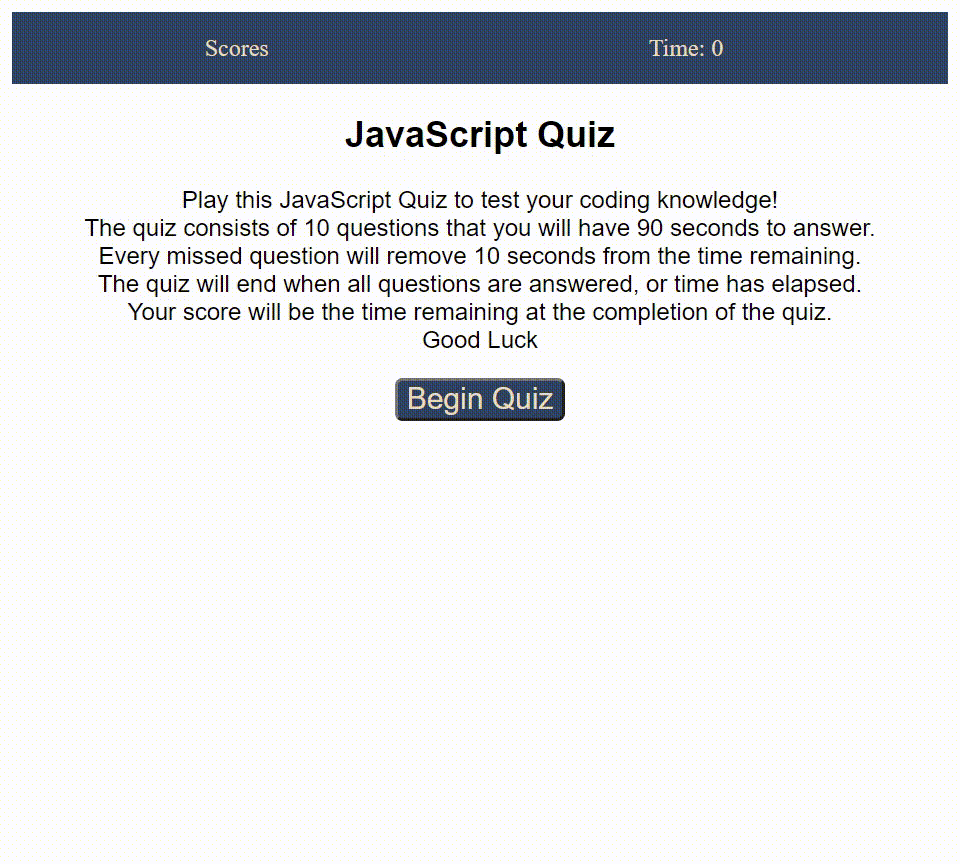

# JavaScript Quiz

## Quiz Opperation
To study JavaScript knowledge easier, I have created a timed quiz. 
When the start button is clicked, a timer begins and the first question is shown. 
Upon each question answered, the next question automatically appears and the answer is recorded.
Each incorrect answer deducts 10 seconds from the remaining time.
The final score is the time remaining in seconds at the completion of the quiz.
When the quiz is over, the user is prompted to enter their initials that are then saved in the local storage.

## Working Quiz

